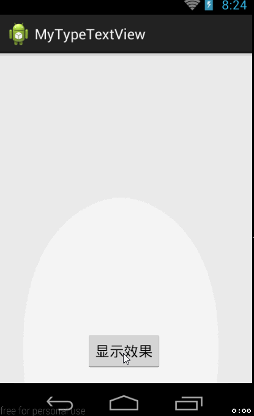

## 说明

**描述：**模仿打字机的效果，字一个一个地蹦出来，伴随打字机的声音。

**效果：**

## 使用说明：

1. 在xml文件中定义：

		<com.example.mytypetextview.TypeTextView
        android:layout_width="match_parent"
        android:layout_height="wrap_content"
        android:id="@+id/ttvId"
         android:layout_centerVertical="true"
         />

2. 在代码中实例化：
	
		mTypeTextView = ( TypeTextView )findViewById(R.id.typeTxtId);
		mTypeTextView.setOnTypeViewListener( new OnTypeViewListener( ) {
			@Override
			public void onTypeStart() {
				print( "onTypeStart" );
			}
			
			@Override
			public void onTypeOver() {
				print( "onTypeOver" );
			}
		});	

3. 调用start方法：
		
		mTypeTextView.start( TEST_DATA );
 
4. 声音资源： res/raw/type_in.wav
